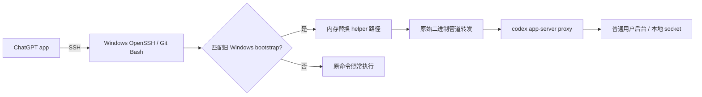

# ChatGPT Windows SSH Repair

[English overview](README.en.md) · [故障复盘](docs/incident-2026-09-27.zh-CN.md) · [验证记录](docs/validation.md) · [MIT](LICENSE)

一次 **ChatGPT app 经 SSH 连接 Windows 主机**的完整排查记录，以及从中提取的可选兼容脚本和协议诊断工具。

适合这样的现象：SSH 认证已经成功，`codex app-server proxy` 直接连接也正常，但 app 仍停在连接中，或 WebSocket 建立后 `initialize` 超时。

这是个人维护的兼容方案，与 OpenAI 无隶属关系。记录来自 2026-09-27 的具体环境；CLI 0.153.4 / 0.157.1 是当时实测版本，并非今天的最低版本要求或安装推荐。新版客户端如果已经不使用本文中的启动脚本，无需套用此补丁。

## 这次遇到了什么

| 层次 | 实际问题 | 处理方式 |
| --- | --- | --- |
| SSH 认证 | 旧 WSL 用户名用于 Windows OpenSSH | 改为真实 Windows 用户名 |
| 运行时 | SSH PATH 仍找到旧 CLI，后台已经升级 | 对齐 SSH shell 与托管后台的 CLI |
| 后台服务 | 旧 socket、控制目录权限及启动方式不一致 | 验证普通用户后台，保留单一有效入口 |
| 协议转发 | 旧 PowerShell relay 的二进制转发停滞 | 原始 stdin 句柄 + 独立双向字节转发 |
| 持久性 | app 重连会重新生成旧 helper | 只在内存中替换匹配的 helper 引用 |

最后一项是兼容脚本的目的。前四层仍需分别核对，不能把所有 SSH 错误都归因于 relay。



## 先诊断

在客户端先验证普通 SSH，再检查远端登录 shell。以下 `windows-dev` 是你自己配置的 SSH 别名：

```sh
ssh windows-dev
ssh windows-dev 'command -v codex; codex --version'
ssh windows-dev 'codex app-server daemon version'
```

`daemon version` 是本案例版本提供的命令。若你的 CLI 没有它，请先检查 `codex app-server --help`，不要为了照抄案例降级运行时。

官方文档要求远端已安装并登录 Codex，而且登录 shell 的 PATH 能找到它。[OpenAI 远程连接说明](https://learn.chatgpt.com/docs/remote-connections#connect-to-an-ssh-host)

协议探针运行在有 SSH 客户端和 Node.js 22+ 的机器上：

```sh
npm ci --ignore-scripts
npm run verify:ssh -- --host windows-dev --mode direct
npm run verify:ssh -- --host windows-dev --mode windows
```

- `direct`：直接启动 `codex app-server proxy`。
- `windows`：使用合成的旧 Windows bootstrap，经 helper、就绪标记和 WebSocket 验证整条路径；依赖远端既有 `codex-path` 和 helper。
- 两种模式均读取 `initialize`、`account/read`、`model/list`，不发送模型推理请求。输出仅含通过状态、平台、登录布尔值和模型数量，不输出账号、令牌或原始 stderr。
- 探针使用 `BatchMode=yes`，需要你现有的密钥或 ssh-agent；不采集密码、不自动信任未知主机。只有密码登录时，可先读复盘，之后在 app 中验证。

`protocol: passed` 表示协议请求正常；`authenticated: false` 表示仍需在远端登录。协议通过不等于 app 打开项目、发送消息已完成验收。

## 可选安装：只针对本文的旧 Windows bootstrap

目标环境：Windows OpenSSH、Git Bash 默认 SSH shell、Windows PowerShell 5.1、已在普通用户会话运行的 Codex 后台。文件应由该登录用户控制；不更改 sshd、注册表、ACL、防火墙或系统服务。

1. 在远端 Windows 主机的 Git Bash 中，将 `compat` 复制到一个新的用户目录。下面的命令遇到已有安装会停止，避免覆盖本地修改：

   ```bash
   # 在本仓库根目录执行
   dest="$HOME/.local/share/chatgpt-windows-ssh-repair"
   if [ -e "$dest" ]; then
       printf '%s\n' '目标目录已存在，请先比较已有文件。' >&2
   else
       mkdir -p "$dest" && cp -R compat "$dest/compat"
   fi
   ```

2. 备份 `~/.bashrc` 和 `~/.bash_profile`，在 `.bashrc` 末尾加上以下内容。不要覆盖已有文件：

   ```bash
   # BEGIN chatgpt-windows-ssh-repair
   . "$HOME/.local/share/chatgpt-windows-ssh-repair/compat/init.bash"
   # END chatgpt-windows-ssh-repair
   ```

3. 若 `.bash_profile` 尚未加载 `.bashrc`，为 SSH 登录 shell 添加以下片段；已有等价逻辑时无需重复：

   ```bash
   if { [ -n "${SSH_CONNECTION:-}" ] || [ -n "${SSH_CLIENT:-}" ]; } && [ -r "$HOME/.bashrc" ]; then
       . "$HOME/.bashrc"
   fi
   ```

4. 断开后重新建立 SSH，再运行两种探针并在 app 中打开项目。无需重启正在工作的后台服务。

`init.bash` 仅在 SSH 环境中工作，优先使用 `${CODEX_HOME:-$HOME/.codex}/packages/app-server-daemon/current/bin` 下存在的运行时。helper 从客户端的 `codex-path` 读取绝对 `.exe` 路径；不支持把 `.cmd` / `.ps1` 当作该运行时。

`compat.bash` 仅包装 SSH shell 中按名称调用的 `powershell.exe`。必须同时匹配专用就绪标记和 `. (Join-Path $controlDirectory 'codex-proxy.ps1')` 才替换引用；绝对路径调用、不同默认 shell、新版不同 bootstrap 均可能不适用。

此方案不会部署后台服务。后台未运行时 helper 会报错，需从 Windows 普通用户桌面会话按该 CLI 版本支持的方式启动。案例中登录计划任务依赖交互登录，不是无人登录后的开机服务方案。

## 回滚

从 `.bashrc` 移除 `BEGIN/END chatgpt-windows-ssh-repair` 块，然后断开并重新建立 SSH。保留自己的其他 shell 配置；无须删除 app 的控制目录。确认没有会话使用后，再自行移除本仓库复制的 `compat` 目录即可。

不要从本案例复制旧用户名、端口转发或 ACL 修改；本仓库不包含这些机器专属设置。

## 测试与目录

```sh
# Windows + Python 3.10+ + Node.js 22+ + Git Bash
npm ci --ignore-scripts
npm test
```

测试在临时目录执行，覆盖分段二进制往返、EOF 退出、中文/空格/单引号路径、匹配条件及非 SSH shell 不受影响；不连接远端、不改用户启动文件。CI 使用 Windows runner。

| 路径 | 内容 |
| --- | --- |
| `docs/incident-2026-09-27.zh-CN.md` | 脱敏故障复盘、排除过程、未验证边界 |
| `docs/validation.md` | 历史现场证据与仓库测试的区别 |
| `compat/` | 可选 relay 与定向 bootstrap 兼容入口 |
| `scripts/verify-ssh.mjs` | 可配置 SSH 协议探针 |
| `tests/` | 本地回归测试 |

## 反馈与许可证

提交 issue 时说明 Windows / PowerShell / CLI 版本、默认 SSH shell，以及失败停在哪一层。不要上传 `auth.json`、私钥、完整聊天记录、原始编码命令或完整事件日志。更多说明见 [CONTRIBUTING.md](CONTRIBUTING.md)。

代码与本文档以 [MIT License](LICENSE) 发布。
